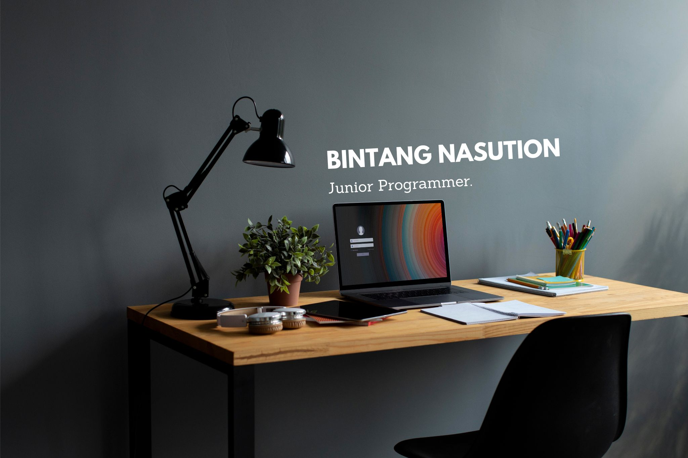

	

## Hi there 👋 Welcome to my GitHub!

## 👨🏻‍💻 &nbsp;About Me

👋 &nbsp;Hi there! I'm Bintang, a Mobile Developer are currently self-taught at Bangkit Academy

🔍 &nbsp;I'm actively seeking roles as a Android Developer or Software Developer

🚀 &nbsp;My technical skills include C++, Java, Javascript, Python, and more, and I'm passionate about using these tools to solve complex problems in the software industry.

🤝 &nbsp;I'm always open to new opportunities and collaborations, so feel free to reach out to me!

## 🛠 &nbsp;Tech Stack
- **Programming Languages:** Java, Kotlin
- **Mobile Development:** 
- **UI/UX Design:** 
- **Backend Integration:** RESTful APIs
- **Database:** 
- **Continuous Integration:** 
- **Versioning:** , 

## 📈 Statistics

## 📕 Pinned Repositories

Image by <a href="https://www.freepik.com/free-photo/online-school-equipment-home_16392735.htm#query=computer%20table&position=2&from_view=search&track=ais">Freepik</a>
